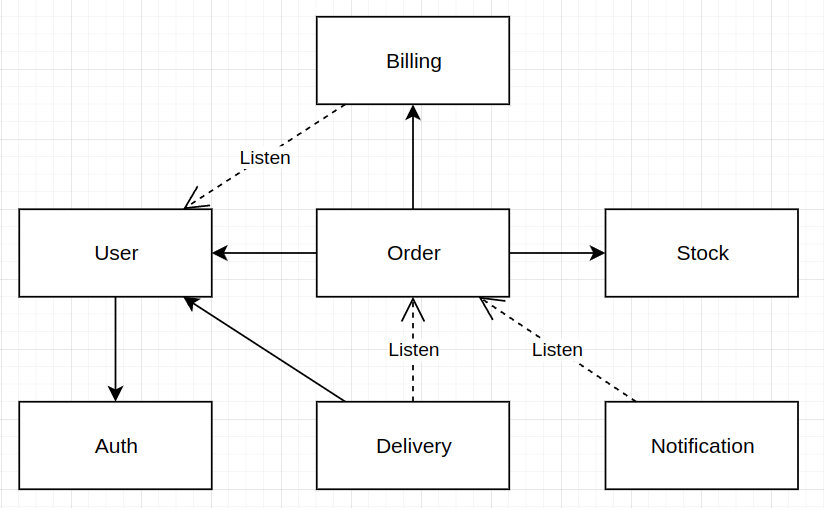

#Домашнее задание: Паттерны декомпозиции микросервисов

##1. Пользовательские сценарии

### Регистрация
Перед использованием сервиса, пользователь обязан пройти регистрацию.

### Пополнение баланса
После регистрации у пользователя появляется личный счет.
Пользователь может внести средства на счет.
Для совершения заказов требуется иметь достаточную сумму на счете.

### Просмотр баланса
Пользователь может просматривать состояние своего счета.

### Создание заказа
Пользователь может создавать заказы.
Если позиций недостаточно на складе, вернется ошибка.
Если на счете пользователя недостаточно средств, вернется ошибка. 

### Просмотр списка заказов
Пользователь может просматривать информацию о своих заказах

### Получение уведомлений о состоянии заказа
Если позиции заказа есть на складе и на счете достаточно средств, то пользователь получит уведомление о том, что заказ готов к доставке.
При успешном выполнении доставки, пользователь также получает уведомление.

##2. Общая схема взаимодействия сервисов

##3. Сервисы

### Auth

Описание:
Обеспечивает аутентификацию пользователей в системе.
Ответственен за создание и хранение пользовательских сессий.

Зависимости:
* *не зависит от других сервисов*

### User
Описание:
Ответственен за создание и хранение профилей пользователей.

Зависимости:
* синхронно обращается к сервису `Auth` при регистрации пользователя.

### Order
Описание:
Ответственен за создание и выполнение заказа пользователя.

Зависимости:
* синхронно обращается к сервису `Stock` для резервирования позиций заказа
* синхронно обращается к сервису `Billing` для оплаты заказа

### Stock
Описание:
Ответственен за хранение информации о наличии доступных для заказа позиций.

Зависимости:
* *не зависит от других сервисов*

### Billing
Описание:
Ответственен за платежный счет пользователя. Выполняет пополнение счета и оплату заказов.

Зависимости:
* слушает событие регистрации пользователя от сервиса `User`

### Delivery
Описание:
Ответственен за выполнение доставки заказа пользователю.

Зависимости:
* слушает события от сервиса `Order` о готовности заказа к выполнению
* синхронно запрашивает информацию о пользователе из сервиса `User`

### Notification
Описание:
Ответственен за отправку пользователям уведомлений.

Зависимости:
* слушает события сервиса `Order`

##4. Контракты взаимодействия

### Auth
api:
* `/internal/api/v1/auth`
* POST `/internal/api/v1/register`
* POST `/api/v1/login`
* POST `/api/v1/logout`

events:
* *отсутствуют*

event handlers:
* *отсутствуют*

### User
api:
* GET `/api/v1/user/profile`
* GET `/internal/api/v1/user/{id}/profile`
* POST `/api/v1/register`
* POST `/api/v1/user/profile`

events:
* `user.user_registered`

event handlers:
* *отсутствуют*

### Order
api:
* GET `/api/v1/orders`
* GET `/api/v1/order/{id}`
* POST `/api/v1/order`

events:
* `order.order_confirmed`
* `order.order_rejected`

event handlers:
* *отсутствуют*

### Stock
api:
* GET `/api/v1/stock/position/{id}/count`
* POST `/api/v1/stock/position/{id}/reserve`

events:
* *отсутствуют*

event handlers:
* `order.order_confirmed`

### Billing
api:
* GET `/api/v1/account`
* POST `/api/v1/account`
* POST `/internal/api/v1/payment`

events:
* *отсутствуют*

event handlers:
* `user.user_registered`

### Delivery
api:
* GET `/api/v1/order/{id}/delivery`
* POST `/api/v1/order/sent`
* POST `/api/v1/order/recieved`

events:
* `delivery.order_sent`
* `delivery.order_recieved`

event handlers:
* *отсутствуют*

### Notification
api:
* GET `/api/v1/notifications`

events:
* *отсутствуют*

event handlers:
* `order.order_confirmed`
* `order.order_rejected`
* `delivery.order_sent`
* `delivery.order_recieved`
